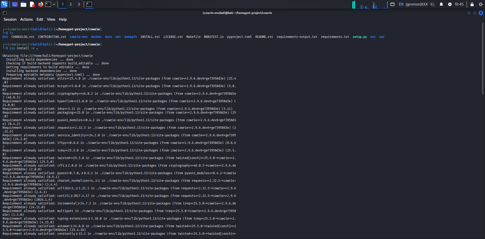
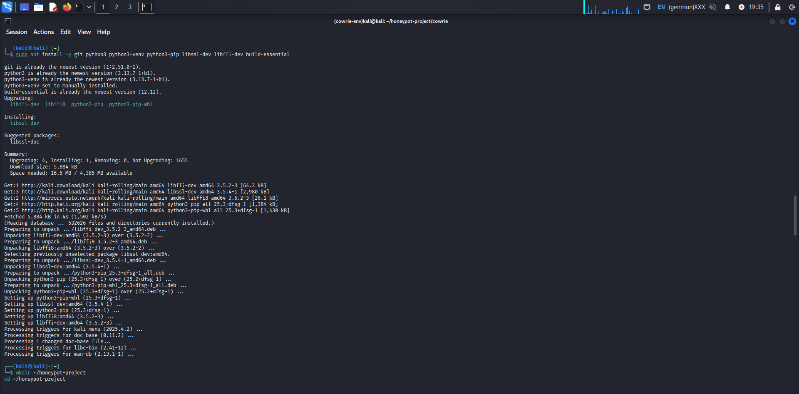
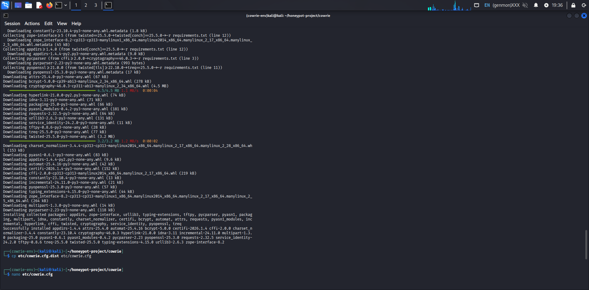
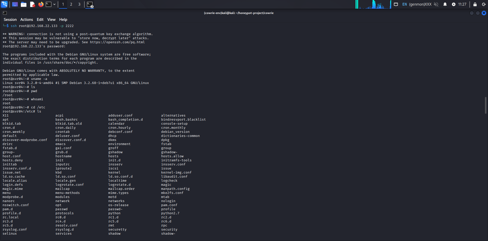
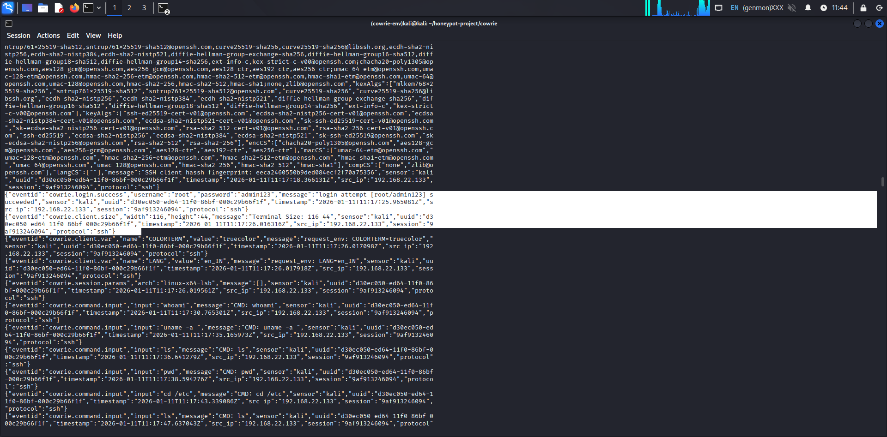
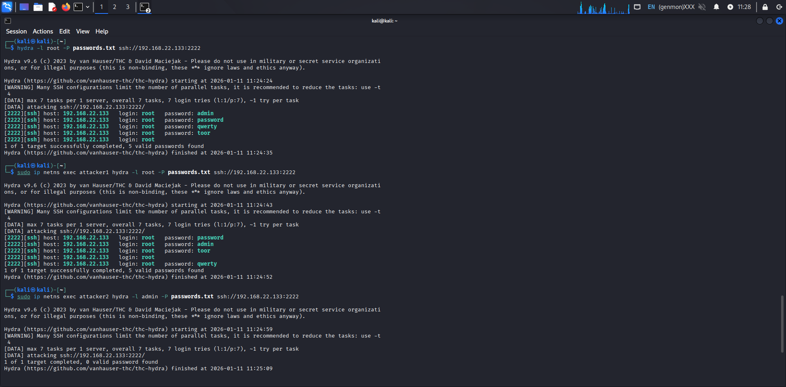
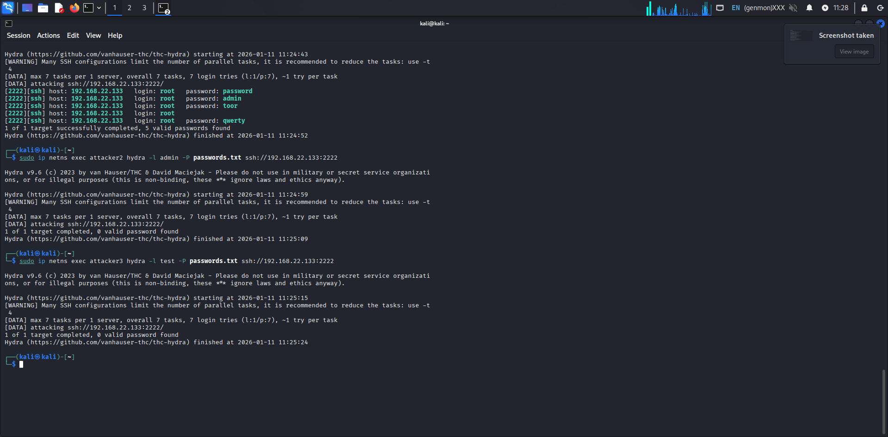
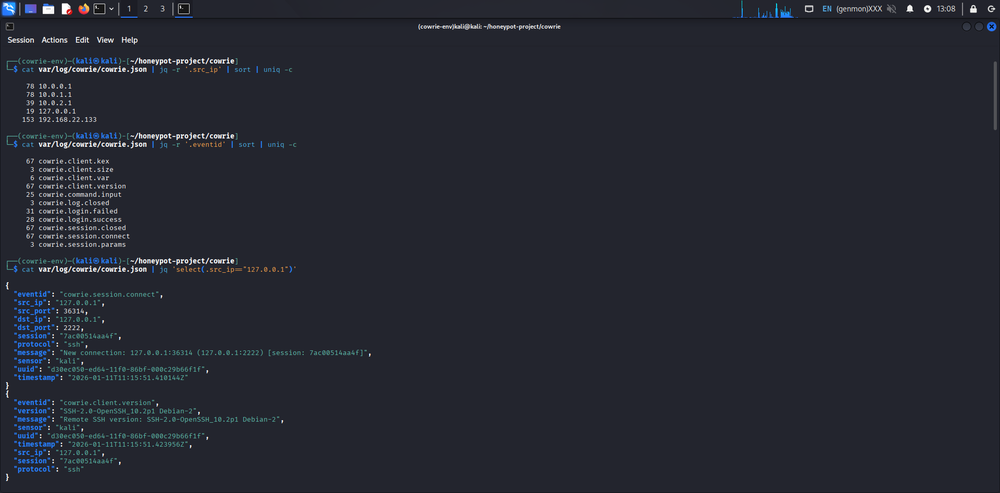
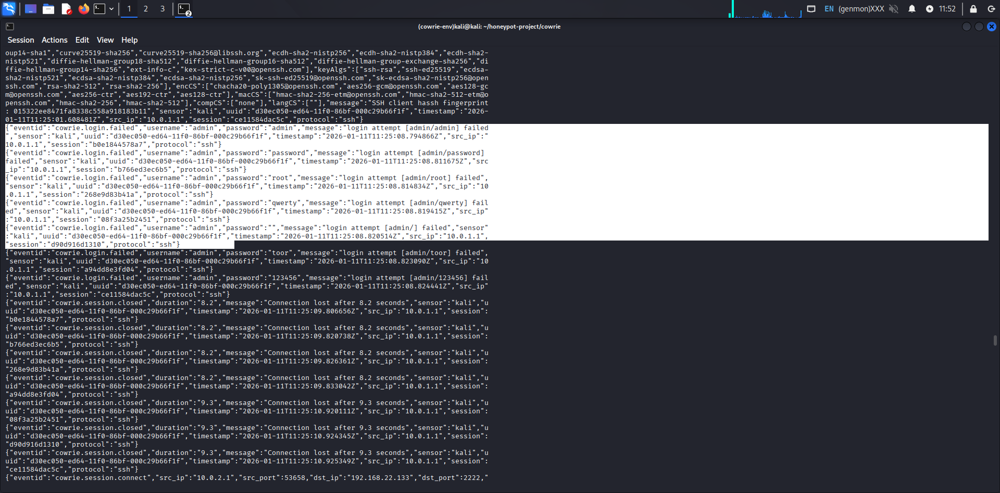
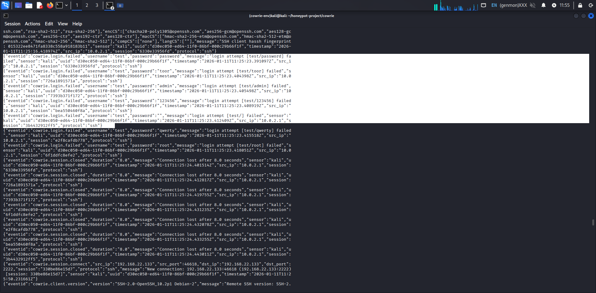

# Cowrie SSH Honeypot Lab – Multi-Attacker Simulation & Threat Analysis

## 📄 Full Project Report
👉 [Download Full PDF Report](Report/Cowrie_Honeypot_REPORT.pdf)

## Overview
This project demonstrates the deployment and analysis of a Cowrie SSH honeypot to simulate real-world brute-force attacks, unauthorized login attempts, and post-compromise attacker behavior. The goal of this lab was to observe attacker techniques, collect telemetry, analyze logs, and map observed activity to the MITRE ATT&CK framework. The honeypot was deployed on Kali Linux, and multiple attacker identities were simulated using Linux network namespaces to generate traffic from different IP addresses. This setup allowed realistic attack behavior to be recorded and analyzed without exposing any real infrastructure.

## Objective
• Deploy and configure Cowrie SSH honeypot • Simulate brute-force and interactive SSH attacks • Capture attacker behavior and credentials • Analyze JSON logs using jq • Identify attack patterns • Map activity to MITRE ATT&CK • Extract Indicators of Compromise (IOCs) • Produce a professional incident-style report

## Lab Environment
| Component         | Description              |
| ----------------- | ------------------------ |
| Attacker OS       | Kali Linux               |
| Honeypot          | Cowrie SSH Honeypot      |
| Attack Tool       | Hydra                    |
| Log Format        | JSON                     |
| Analysis Tool     | jq                       |
| Simulation Method | Linux network namespaces |
 
## 🔧 Cowrie Installation
This section demonstrates the setup of Cowrie and its dependencies on Kali Linux.

## Attack Simulation
| Attacker   | Source IP | Tool Used | Attack Type         |
| ---------- | --------- | --------- | ------------------- |
| Attacker 1 | 10.0.0.1  | Hydra     | Brute-force SSH     |
| Attacker 2 | 10.0.1.1  | Hydra     | Brute-force SSH     |
| Attacker 3 | 10.0.2.1  | Hydra     | Credential guessing |
| Local Test | 127.0.0.1 | SSH       | Manual interaction  |
Each attacker generated authentication attempts, some of which succeeded. Successful logins were followed by interactive shell commands.

## 🔐 SSH Login Simulation

## ⚔️ Hydra Brute Force Attacks

## Observed Attacker Commands
After gaining access, attackers attempted reconnaissance and enumeration using commands such as:
• whoami
• uname -a
• ls
• pwd
• cd /etc
• cat passwd
• exit
These commands indicate early-stage system exploration.

## 💻 Commands
All commands used during installation, attack simulation, and log analysis:
👉 [View Commands](commands-used.md)

## Log Analysis
Cowrie logs all activity in structured JSON format.
Using jq, the following were extracted:
• Source IP addresses
• Successful logins
• Failed logins
• Session start and end times
• Commands entered
• SSH client fingerprints
Example filters used:
jq 'select(.eventid=="cowrie.login.success")'
jq 'select(.eventid=="cowrie.command.input")'
jq -r '.src_ip' | sort | uniq -c

## 📊 Logs

## MITRE ATT&CK Mapping
| Technique ID | Name                   | Evidence                |
| ------------ | ---------------------- | ----------------------- |
| T1110        | Brute Force            | Hydra password attempts |
| T1021        | Remote Services        | SSH login sessions      |
| T1059        | Command-Line Interface | whoami, uname, ls       |
| T1082        | System Info Discovery  | uname -a                |
| T1087        | Account Discovery      | cat passwd              |

## Indicators of Compromise (IOCs)
| Type      | Value                  | Description          |
| --------- | ---------------------- | -------------------- |
| Source IP | 10.0.0.1               | Brute-force attacker |
| Source IP | 10.0.1.1               | Credential guessing  |
| Source IP | 10.0.2.1               | Failed logins        |
| Usernames | root, admin, test      | Targeted accounts    |
| Passwords | password, toor, qwerty | Common weak creds    |

## Security Insights 
• Weak credentials are still heavily targeted
• SSH remains a major attack surface
• Attackers perform immediate reconnaissance
• Brute-force tools generate identifiable patterns
• Honeypots provide high-fidelity telemetry 

## Limitations
• Simulated attackers, not real internet traffic
• No malware payloads deployed
• No lateral movement
• Single service focus (SSH)

## Future Improvements 
• Public deployment for real-world data
• SIEM integration (Splunk/ELK)
• GeoIP enrichment
• Malware capture
• Alerting rules
• Dashboarding

## Skills Demonstrated
• Honeypot deployment
• Linux networking
• SSH security
• Brute-force simulation
• Log analysis
• Threat intelligence
• MITRE ATT&CK mapping
• Incident-style reporting

## Disclaimer
This project was conducted in a controlled lab environment for educational and research purposes only.
